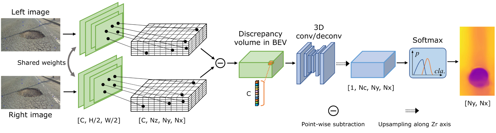

## Introduction
This is the implementation of the work: [RoadBEV: Road Surface Reconstruction in Bird’s Eye View](https://arxiv.org/abs/XXX).

Road surface reconstruction, an essential task for autonomous driving comfort control, suffers from poor performance in perspective view.
We propose RoadBEV-mono and RoadBeV-stereo, which reconstruct road surface with monocular and stereo images, respectively.



<center style="font-size:14px;color:#C0C0C0;text-decoration:underline">Backbone of RoadBEV-stereo</center>


## Data preparation

We use Road Surface Reconstruction Dataset (RSRD). The GT elevation maps should be generated off-line, as it costs much computation.

* First, download [RSRD](https://thu-rsxd.com/rsrd) (the dense subset of 15.1GB) and the calibration files in [dev kit](https://github.com/ztsrxh/RSRD_dev_toolkit).
Set the corresponding path in *dataset.py*.

* Generate and save the GT maps to local. The GT maps depend on ROI and horizontal resolution. 
We do not recommend changing the related parameters in *dataset.py*, as they are determined based on statistic analysis on the dataset. 
Changes on them may lead to errors and inconsistent results. If you do change, re-generate corresponding GT.

```
python preprocess_gt.py --save_dir '/data/preprocessed/' --dataset 'train'
python preprocess_gt.py --save_dir '/data/preprocessed/' --dataset 'test'
```
The elevation maps along with masks are saved in *.pkl* format.  


## Environment
* Python 3.9
* Pytorch 1.11.0

### Create a virtual environment and activate it.

```
conda create -n roadbev python=3.9
conda activate roadbev
```
### Dependencies
```
conda install pytorch torchvision torchaudio cudatoolkit=11.3 -c pytorch -c nvidia
conda install -c open3d-admin open3d
pip install opencv-python
pip install pillow
```

## Train
Use the following command to train RoadBEV-mono:

```
python train.py --lr 8e-4
```

Use the following command to train RoadBEV-stereo:
```
python train.py --stereo --lr 5e-4
```

## Test
```
python test.py --loadckpt 'xxx.ckpt'  # test RoadBEV-mono
python test.py --stereo --loadckpt 'xxx.ckpt'  # test RoadBEV-stereo
```

## Results
### Pretrained Model
[RoadBEV-mono](https://drive.google.com/file/d/1bWDII9H2xwyKU0rgED5l-P8vXeUymyCW/view?usp=sharing), 
[RoadBEV-stereo](https://drive.google.com/file/d/1qxtDyKbso-k5-sRuLMbqJMYdsg9OWf5-/view?usp=sharing)

### Performance for road surface reconstruction with RoadBEV-mono
| Method | Abs. err. (cm) | RMSE |
|:-:|:-:|:-:|
| LapDepth | 2.81 | 3.12 |
| PixelFormer | 2.65 | 2.86 |
| iDisc | 2.64 | 2.88 | 
| AdaBins | 2.59 | 2.79 |
| RoadBEV-mono(Ours) | 1.83 | 2.07 |

### Performance for road surface reconstruction with RoadBEV-stereo
| Method | Abs. err. (cm) | RMSE |
|:-:|:-:|:-:|
| IGEV-Stereo | 0.651 | 0.797 |
| PSMNet | 0.654 | 0.785 | 
| CFNet | 0.647 | 0.760 |
| ACVNet | 0.596 | 0.723 |
| GwcNet | 0.588 | 0.711 |
| RoadBEV-stereo(Ours) | 0.563 | 0.697 |

### Distance-wise absolute error


## Visualization of reconstruction by RoadBEV-mono


## Visualization of reconstruction by RoadBEV-stereo


# Citation

If you find this project helpful in your research, welcome to cite the paper.

```bibtex


```
