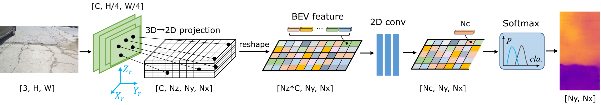
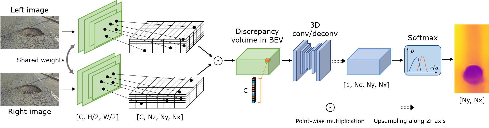
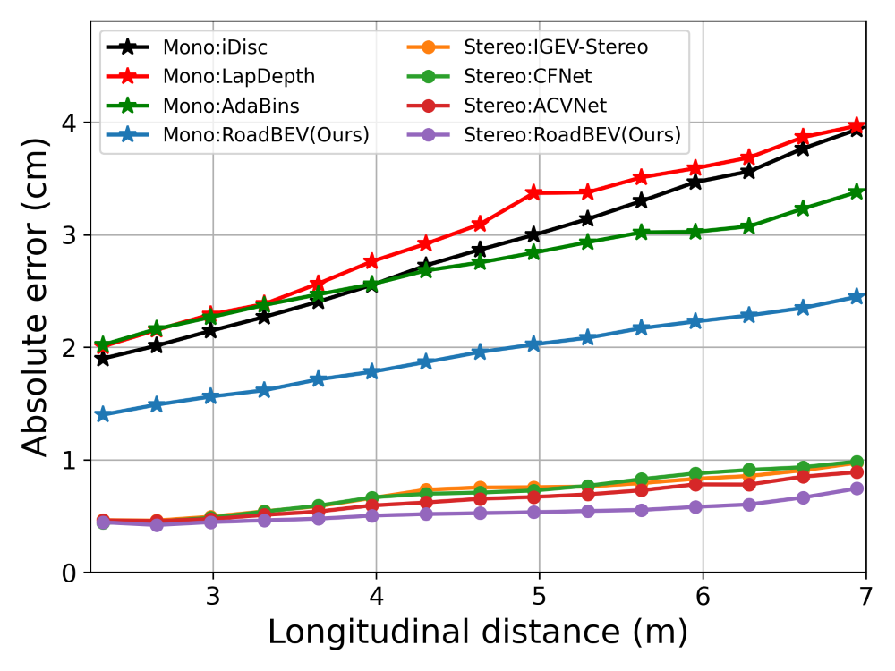
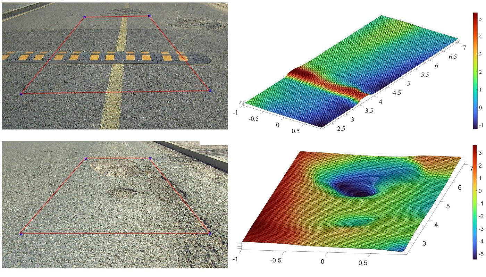

## Update logs and News
* 23/April/2024 - **We have revised and updated version 2 of the paper.**
* 19/April/2024 - We have fixed the problem of *TypeError: can't pickle xxxx objects* in code.
* 17/April/2024 - We fixed the code problem in 3D-2D projection of RoadBEV-stereo.
  
## Introduction
This is the implementation of the work: [RoadBEV: Road Surface Reconstruction in Bird’s Eye View](https://arxiv.org/abs/2404.06605).

Road surface reconstruction, an essential task for autonomous driving comfort control, suffers from poor performance in perspective view.
We propose RoadBEV-mono and RoadBeV-stereo, which reconstruct road surface with monocular and stereo images in Bird's Eye View, respectively.




## Data preparation

We use Road Surface Reconstruction Dataset (RSRD). The GT elevation maps should be generated off-line, as it costs much computation. The dataset used here is extracted from trainset of RSRD-dense. We split it into train (1210) and test (371) sets. You can split some from the train set for validation. The samples' info (including path, pose, location) are stored in *pkl* files in the *filenames* folder of this repo.

* First, download [RSRD](https://thu-rsxd.com/rsrd) (the dense subset of 15.1GB) and the calibration files in [dev kit](https://github.com/ztsrxh/RSRD_dev_toolkit).
**Set the corresponding path in *dataset.py***.

* Generate and save the GT maps to local. The GT maps depend on ROI and horizontal resolution. 
We do not recommend changing the related parameters in *dataset.py*, as they are determined based on statistic analysis on the dataset. 
Changes on them may lead to errors and inconsistent results. If you do change, re-generate corresponding GT.

```
python preprocess_gt.py --save_dir '/data/preprocessed/' --dataset 'train'
python preprocess_gt.py --save_dir '/data/preprocessed/' --dataset 'test'
```
　　The elevation maps along with masks are saved in *.pkl* format. For convenience, you can also directly download generated GT labels [here](https://drive.google.com/file/d/1m3G7Cb_qfIg2Q5Ng4-NdSMb66RDtEI2Z/view?usp=sharing).

> [!NOTE]  
> * Further, we provide the info for all samples in the RSRD-dense, which contains 2430 training and 296 testing samples [download](https://drive.google.com/file/d/1Hb2meQSmN9CCOkOwUJbHjv76yBUY2pWx/view?usp=sharing).
> * The sample info for RSRD-sparse is also available, which contains 13K samples [download](https://drive.google.com/file/d/1i4lAahSvn8VVRCLqRpOJdvo2dOmLOppJ/view?usp=sharing). It has very sparse GT point cloud labels, which can be used for pretraining or unsupervised learning.

The directories should be like:
```shell
RoadBEV
├── utils
│   └── dataset.py
├── filenames
│   ├── train
│   │    ├── 20230317074852.000.pkl
│   │    └── ...
│   ├── test
│   │    ├── 20230317075641.200.pkl
│   │    └── ...
├── train.py
├── test.py
└── preprocess_gt.py

RSRD-dense
├── train
│   ├── 2023-03-17-07-48-37
│   │    ├── left_half
│   │    ├── right_half
│   │    ├── pcd
│   │    └── ...
│   ├── 2023-03-21-07-36-59
│   └──...

preprocessed
├── train
│   ├── 20230409021332.400.pkl
│   └── ...
├── test
│   ├── 20230409015836.600.pkl
│   └── ...
```
## Environment
* Python 3.7
* Pytorch 1.10.0
* open3d 0.16.0

### Create a virtual environment and activate it.

```
conda create -n roadbev python=3.7
conda activate roadbev
```
### Dependencies
```
conda install pytorch=1.10.0 torchvision torchaudio cudatoolkit=11.1 -c pytorch -c nvidia
conda install -c open3d-admin open3d
pip install opencv-python
pip install pillow
```

## Train
Use the following command to train RoadBEV-mono:

```
python train.py --lr 8e-4
```

Use the following command to train RoadBEV-stereo:
```
python train.py --stereo --lr 5e-4
```

## Test
```
python test.py --loadckpt 'xxx.ckpt'  # test RoadBEV-mono
python test.py --stereo --loadckpt 'xxx.ckpt'  # test RoadBEV-stereo
```

## Results
### Pretrained Model
[RoadBEV-mono](https://drive.google.com/file/d/1i-QgX8rLTDUmqpRN7bM4_AzK8dgk_PUn/view?usp=sharing), 
[RoadBEV-stereo](https://drive.google.com/file/d/1H5mTGfr2udMfYxvoqKXPsuo_-Ggu1mib/view?usp=sharing)

### Performance for road surface reconstruction with RoadBEV-mono
| Method | Abs. err. (cm) | RMSE | >0.5cm (%) |
|:-:|:-:|:-:|:-:|
| LapDepth | 2.81 | 3.12 | 85.3 |
| PixelFormer | 2.65 | 2.86 | 82.0 |
| iDisc | 2.64 | 2.88 | 84.3 |
| AdaBins | 2.59 | 2.79 | 82.4 |
| RoadBEV-mono(Ours) | 1.83 | 2.07 | 78.6 |

### Performance for road surface reconstruction with RoadBEV-stereo
| Method | Abs. err. (cm) | RMSE | >0.5cm (%) |
|:-:|:-:|:-:|:-:|
| IGEV-Stereo | 0.651 | 0.797 | 49.5|
| PSMNet | 0.654 | 0.785 |  50.1 |
| CFNet | 0.647 | 0.760 | 50.8 |
| ACVNet | 0.596 | 0.723 | 46.2 |
| GwcNet | 0.588 | 0.711 | 44.9 |
| [DVANet](https://github.com/ztsrxh/DVANet) | 0.546 | 0.685 | 40.9 |
| RoadBEV-stereo(Ours) | 0.503 | 0.609 | 37.0 |

### Distance-wise absolute error


## Visualization of reconstruction by RoadBEV-mono
Visualize the inference results saved as *.pkl* files in *test.py*:
```
python visualization.py
```


## Visualization of reconstruction by RoadBEV-stereo


## Future research
This is the first exploration of reconstructing road surface in BEV. Future research can be improved in the following aspects:
* More accuract 3D-2D indexing. We directly index the integer pixel without interpolation of nearby features.
* More advanced backbone. Introducting attention mechanism, transformer...
* Classification with offsets. We regress elevation values with soft argmin(weighted sum of bins). Peak class with offset can also be adopted.
* More efficient estimation head. For RoadBEV-stereo, the 3D convs cost much computation. More strategies can be explored.
* Utilizing the RSRD-sparse. It contains much more samples, which will greatly enhance model generalization capability.
* Our previous research [DVANet](https://github.com/ztsrxh/DVANet), which reconstructs road surface with direct stereo matching, may provide valuable insights.
# Citation

If you find this project helpful in your research, welcome to cite the paper.

```bibtex
@misc{zhao2024roadbev,
      title={RoadBEV: Road Surface Reconstruction in Bird's Eye View}, 
      author={Tong Zhao and Lei Yang and Yichen Xie and Mingyu Ding and Masayoshi Tomizuka and Yintao Wei},
      year={2024},
      eprint={2404.06605},
      archivePrefix={arXiv},
      primaryClass={cs.CV}
}

```
